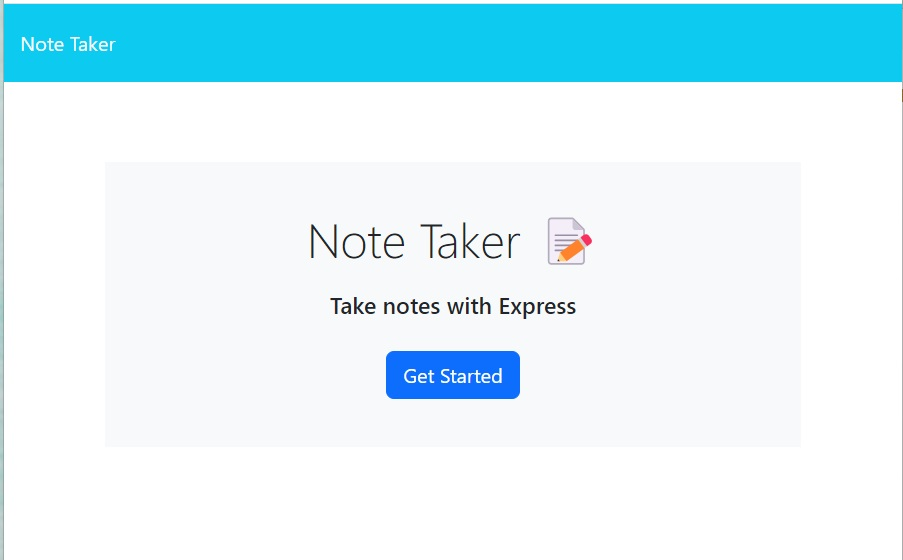
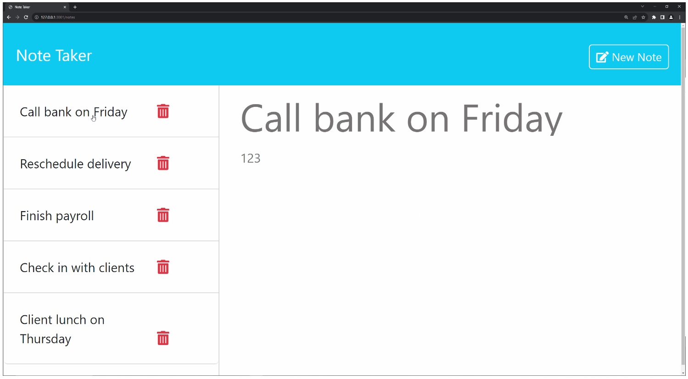
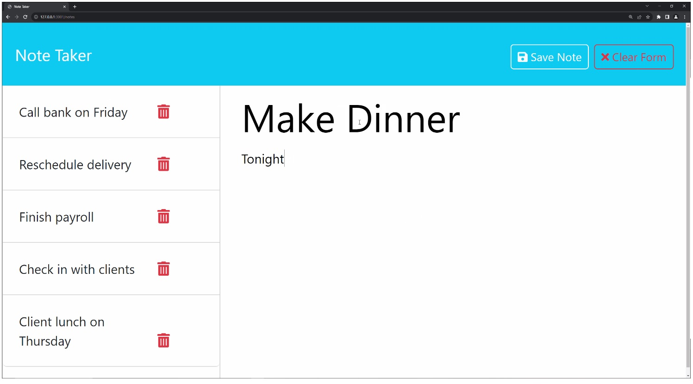

# note-taker

## Description
This application can be used to write and save notes.

### User-Story
AS A small business owner

I WANT to be able to write and save notes

SO THAT I can organize my thoughts and keep track of tasks I need to complete

### Acceptance-Criteria
GIVEN a note-taking application

WHEN I open the Note Taker

THEN I am presented with a landing page with a link to a notes page

WHEN I click on the link to the notes page

THEN I am presented with a page with existing notes listed in the left-hand column, plus empty fields to enter a new note title and the note’s text in the right-hand column

WHEN I enter a new note title and the note’s text

THEN a "Save Note" button and a "Clear Form" button appear in the navigation at the top of the page

WHEN I click on the Save button

THEN the new note I have entered is saved and appears in the left-hand column with the other existing notes and the buttons in the navigation disappear

WHEN I click on an existing note in the list in the left-hand column

THEN that note appears in the right-hand column and a "New Note" button appears in the navigation

WHEN I click on the "New Note" button in the navigation at the top of the page

THEN I am presented with empty fields to enter a new note title and the note’s text in the right-hand column and the button disappears

### Mock-Up

Note Taker get started page

Note Taker new note example

Note Taker save note example

## Installation-Execution

Open a command terminal, go to the note-taker folder and execute server.js using the command "node server.js". This will start your server.

Open a browser and type localhost:3001.

The browser will open the main screen for Note Taker. Click on <Get Started>.

Once you are in the notes list screen, you can do the following:

1. Type in a Note Title and Note Text and click <Save Note> to create a note.

2. Type in a Note Title and Note Text and click on <Clear> to clear out what you've typed.

3. Click on an existing note to have it show on the right side screen with details. You will also see the <New Note> button appear.

4. Click on the "delete" symbol next to any note and it will be deleted and the left side list will be updated.

## Usage

The Note Taker app can be used to keep track of your to do list. You can add your to-do item (like washing the car) along with a title. You can also delete items off of your list as you complete them. Your items with their titles will be saved in a local file on your computer, so that if you exit out of the app and then go back in, your list will still be accurate.

## Testing
N/A

## Credits
N/A

## License
N/A